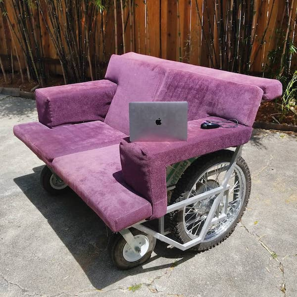

~~~
        _____       ____      __  ___      __  _       
       / ___/____  / __/___ _/  |/  /___ _/ /_(_)____  
       \__ \/ __ \/ /_/ __ `/ /|_/ / __ `/ __/ / ___/  
      ___/ / /_/ / __/ /_/ / /  / / /_/ / /_/ / /__    
     /____/\____/_/  \__,_/_/  /_/\__,_/\__/_/\___/    
~~~

## Overview

This code is used to control the motors that drive the SofaMatic, a
[Mutant Vehicle](https://burningman.org/event/art-performance/mutant-vehicles/)
created by [Marcus Schwartz](http://marcus.net/) for the
[Burning Man](http://burningman.org/) festival.

The goal of this software is to provide easy, intuitive, videogame-like
control of a vehicle with differential steering (ie. tank-style steering).

There are two major components.  The `remote` streams joystick data over
WiFi/UDP to the `sofa`, which translates the data into motor speeds.

## The Remote

The [remote/](https://github.com/marcusschwartz/sofamatic/tree/master/remote)
folder contains an arduino project that is expected to run on an
[ESP8266](https://en.wikipedia.org/wiki/ESP8266)
such as the [Adafruit Feather Huzzah](https://www.adafruit.com/product/2821).
It expects a
[Nintendo Wii Nunchuk](https://en.wikipedia.org/wiki/Wii_Remote#Nunchuk) to be
wired to the I2C pins, along with an OLED display such as the
[Adafruit FeatherWing OLED](https://www.adafruit.com/product/2900).

## The Sofa

The [sofa/](https://github.com/marcusschwartz/sofamatic/tree/master/sofa)
folder contains python code that can be run on any machine with a Roboteq
motor controller attached to a serial port.  I used an
[Onion Omega2+](https://onion.io/omega2/) attached to a
[Roboteq MDC2460](https://www.roboteq.com/index.php/component/virtuemart/313/mdc2460-274-detail?Itemid=970)
motor controller.
